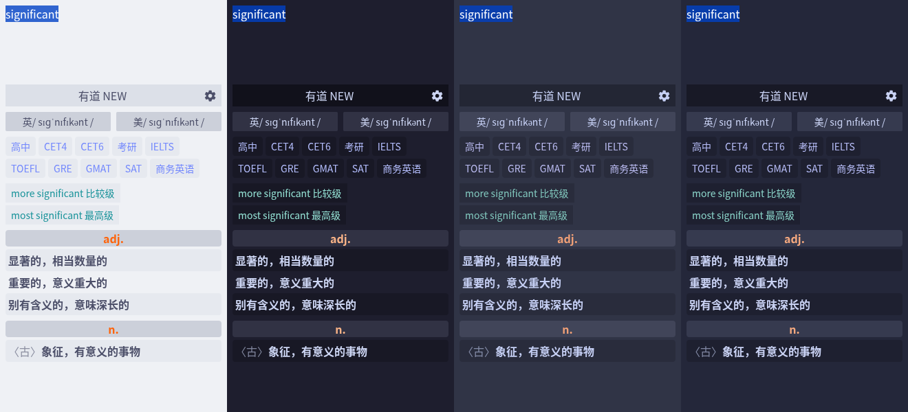
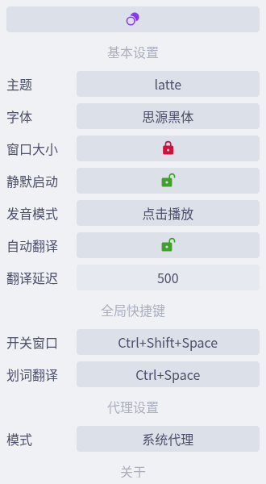

# mtranslate - 跨平台桌面翻译工具

<h3 align="center">
   
</h3>

快速、便捷的文本翻译。

## 概览

- Windows、macOS、Linux
- 多种 API
- 划词翻译

## 多主题

- catppuccin 系列

  

## 自定义配置

基本配置：

- 主题切换
- 字体更改
- 窗口大小
- 静默启动
- 发音模式
- 自动翻译
- 翻译延迟

全局快捷键：

- 打关窗口
- 划词翻译

代理模式：

- 系统代理
- 直连
- 手动代理
- PAC 脚本
- 自动检测

版本：

- 检查更新

  

## 翻译接口

- [有道 NEW「开箱即用」](https://dict.youdao.com/w/)
- [有道 OLD「开箱即用」](https://dict.youdao.com/)
- [有道智云 API](https://ai.youdao.com/console/#/)
- [DeepLPro 四译堂 API](https://deepl-pro.com/#/translate)
- ... 其他接口将陆续实现
